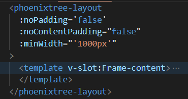
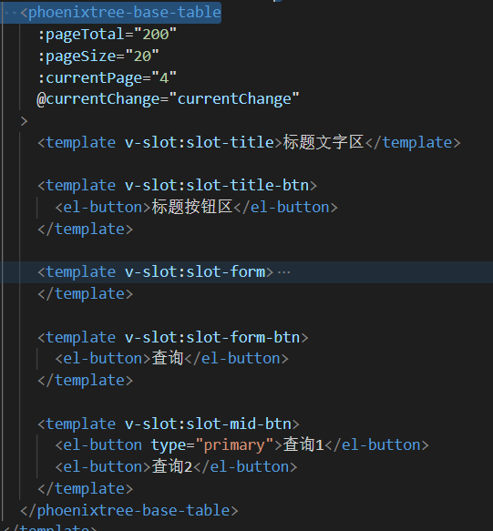
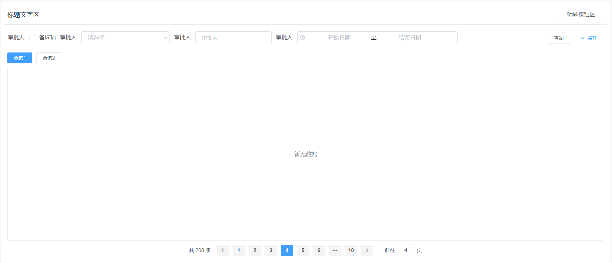
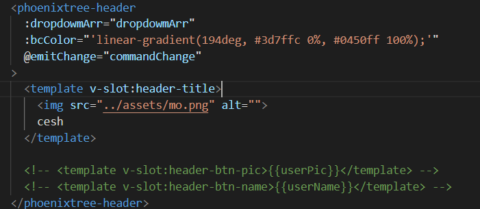

# phoenixtree-vue-plugin

#### 使用方式
```js
	在main.js进行全局引入;
	import phoenixtreeVuePlugin from "phoenixtree-vue-plugin";
	import "phoenixtree-vue-plugin/lib/phoenixtreeVue.css";
	Vue.use(phoenixtreeVuePlugin);
```

#### 内容
##### 基础布局组件：phoenixtree-layout; 
###### 示例：

使用：



###### slot: 
	1. name: Frame-content(v1.1.12) 

###### Attribute: 
	1. noPadding：对外层padding控制(v1.1.12) 
		type：Boolean
		default: false  
		
	2. noContentPadding：对内层padding控制(v1.1.12) 
		type：Boolean 
		default: false 
	
	3. minWidth: 布局组件最小宽度控制(v1.1.12) 
		type: String 
		default: '900px'


##### 基础混合表格组件：phoenixtree-base-table; 
###### 示例：

使用：



效果：



###### slot: 
	1. 标题(v1.1.12) 
		name: slot-title

	2. 标题按钮区(v1.1.12) 
		name: slot-title-btn
	
	3. 筛选区(v1.1.12) 
		name: slot-form
	
	4. 筛选按钮区(v1.1.12) 
		name: slot-form-btn
	
	5. 中部按钮区(v1.1.12) 
		name: slot-mid-btn
	
	6. 表格区(v1.1.12) 
		name: slot-table
	
	7. 底部按钮区(v1.1.12) 
		name: slot-page

###### Attribute: 
	1. pageTotal: 分页总条数(v1.1.12) 
		type: Number 
		default: 100 

	2. pageSize: 分页单页显示数量(v1.1.12) 
		type: Number 
		default: 30 

	3. currentPage: 分页当页页码(v1.1.12) 
		type: Number 
		default: 1 

	4. pageBcColor: 分页选中项背景色(v1.1.12) 
		type: String 
		default: '#409eff' 

	5. pageTxtColor: 分页选中项文字颜色(v1.1.12) 
		type: String 
		default: '#ffffff' 

###### Methods: 
	1. currentChange(num): 当前页码改变触发函数(v1.1.12) 
		num: 当前页码值
    
##### 基础头部信息栏组件：phoenixtree-header; 

###### 示例：

使用：



效果：


###### slot: 
	左侧系统信息区域(可写入一个25*25的icon)(v1.1.12) 
	name: slot-header-title

	右侧用户信息区域
	1. 用户帐号首字符(v1.1.12) 
		name: slot-header-btn-pic

	2. 用户帐号(v1.1.12) 
		name: slot-header-btn-name

###### Attribute: 
	1. dropdowmArr: 悬浮下拉数组(v1.1.12) 
		type: Array
		default:
		[
			{
				name: '退出登录',
				command: 'logOut'
			}
		]

		name: 展示名称
		command: 点击操作区别标识

	2. bcColor: 组件背景色(v1.1.12) 
		type: String 
		default: '#3d7ffc' 

	3. sysColor: 系统标题颜色(v1.1.12) 
		type: String 
		default: '#ffffff' 

	4. picBcColor: 用户帐号首字母背景色(v1.1.12) 
		type: String 
		default: '#ffffff' 

	5. picColor: 用户帐号首字母颜色(v1.1.12) 
		type: String 
		default: '#3d7ffc' 

	6. nameColor: 用户帐号颜色(v1.1.12) 
		type: String 
		default: '#ffffff' 

###### Methods:
	悬浮下拉点击触发函数
	1. emitChange(str)(v1.1.12) 
		str: 值为command区别标识

